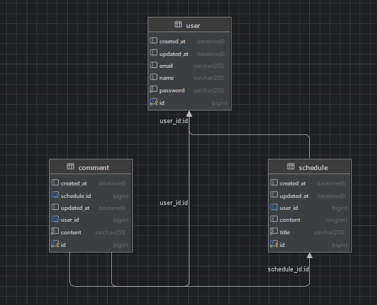

# 📖 Schedule Project

## 💠개요

Schedule Project는 유저정보를 등록 & 일정을 입력받아 클라이언트에서 온 요청을
처리 해주는 서버 입니다. 로그인 기능을 추가해 로그인한 유저만 일정을 작성 조회 등,댓글 작성이 
가능합니다 
---

## 요구사항

## #️⃣ 도전

⏹️ 일정 생성

- [ ]  일정을 생성, 조회, 수정, 삭제할 수 있습니다.
- [ ]  일정은  필드를 가집니다. `작성 유저명`, `할일 제목`, `할일 내용`, `작성일`, `수정일` 필드
- [ ]  `작성일`, `수정일` 필드는 `JPA Auditing`을 활용

⏹️ 유저 생성

- [ ]  유저를 생성, 조회, 수정, 삭제할 수 있습니다.
- [ ]  유저는 필드를 가집니다.
   `유저명`, `이메일`, `작성일` , `수정일` 필드
- [ ]  `작성일`, `수정일` 필드는 `JPA Auditing`을 활용합니다.
- [ ]  일정은 이제 `작성 유저명` 필드 대신 `유저 고유 식별자` 필드를 가집니다.

⏹️ 회원가입

- [ ] 유저에 비밀번호 필드를 추가합니다.

⏹️ 로그인

- [ ]  **Cookie/Session**을 활용해 로그인 기능을 구현합니다. 
- [ ]  필터를 활용해 인증 처리를 할 수 있습니다.
- [ ]  `@Configuration` 을 활용해 필터를 등록할 수 있습니다.

- [ ]  `이메일`과 `비밀번호`를 활용해 로그인 기능을 구현합니다.
- [ ]  회원가입, 로그인 요청은 인증 처리에서 제외합니다.

- [ ]  로그인 시 이메일과 비밀번호가 일치하지 않을 경우 HTTP Status code 401을 반환합니다.

## 2️⃣ 필수

⏹️ 다양한 예외처리 적용

- [ ]  Validation을 활용해 다양한 예외처리를 적용해 봅니다.
- [ ]  정해진 예외처리 항목이 있는것이 아닌 프로젝트를 분석하고 예외사항을 지정해 봅니다.
- [ ]  Ex) 할일 제목은 10글자 이내, 유저명은 4글자 이내
- [ ]  `@Pattern`을 사용해서 회원 가입 Email 데이터 검증 등
- [ ]  정규표현식을 적용

⏹️ 비밀번호 암호화

- [ ]  비밀번호 필드에 들어가는 비밀번호를 암호화합니다.

⏹️ 댓글 CRUD

- [ ]  생성한 일정에 댓글을 남길 수 있습니다.
- [ ]  댓글과 일정은 연관관계를 가집니다.
- [ ]  댓글을 저장, 조회, 수정, 삭제할 수 있습니다.
- [ ]  댓글은 필드를 가집니다. `댓글 내용`, `작성일`, `수정일`, `유저 고유 식별자`, `일정 고유 식별자` 필드
- [ ]  `작성일`, `수정일` 필드는 `JPA Auditing`을 활용하여 적용합니다.

⏹️ 일정 페이징 조회

- [ ]  일정을 Spring Data JPA의 `Pageable`과 `Page` 인터페이스를 활용하여 페이지네이션을 구현
- [ ]  `페이지 번호`와 `페이지 크기`를 쿼리 파라미터로 전달하여 요청하는 항목을 나타냅니다.
- [ ]  `할일 제목`, `할일 내용`, `댓글 개수`, `일정 작성일`, `일정 수정일`, `일정 작성 유저명` 필드를 조회합니다.
- [ ]  디폴트 `페이지 크기`는 10으로 적용합니다.
- [ ]  일정의 `수정일`을 기준으로 내림차순 정렬합니다.

## 💠 주요 기능

- **회원가입**

- **로그인 체크**

- **일정 CRUD**

- **댓글 CRUD**

## 💠 기술 스택

- **언어**: Java
- **DB**: MySql
- **개발 툴**: IntelliJ IDEA
- **프레임워크**: Spring Boot
- **편의 기능**: RomBok,Thymeleaf,Validation,Spring JPA,bcrypt(비밀번호 암호화)
## 💠 API 명세서
💠일정

| 기능 이름   | Method | Url                               | Request                                                                                    | Response | Status           |
|---------|--------|-----------------------------------|--------------------------------------------------------------------------------------------|----------|------------------|
| 일정 등록   | POST   | /schedule/v1/schedule             | 요청 body{"id":1,"title":"2번","content":"내용입니다"}                                 | 등록 정보    | 200: 정상등록 400:오류        |    
| 전체 일정 조회 | GET    | /schedule/v1/schedules            | 요청 param    | 다건 응답 정보 | 200: 정상조회  400:오류       |
| 페이지 조회  | GET    | /v2/schedules?size=&page=         | 요청 param                                                                                   | 다건 응답 정보 | 200: 정상조회 400:오류        |
| 선택 일정 업데이트 | PATCH  | /schedule/v1/schedule/{schedulesId} | 요청 body{"title":"수정제목","content":"수정내용"}                              | -        | 200: 정상수정 400:오류       |
| 선택 일정 삭제 | DELETE | /schedule/v1/schedule/{schedulesId} |                                                             | -        | 200: 정상삭제 400:오류 |

💠유저

| 기능 이름      | Method | Url                                 | Request                                                                                  | Response | Status           |
|------------|--------|-------------------------------------|------------------------------------------------------------------------------------------|----------|------------------|
| 유저 등록      | POST | /user/v1/user                       | 요청 body {"name":"wonju","email":"dnjs7469@naver.com","password":"1234"}                               | -        | 200: 정상등록        |
| 전체 유저 조회   | GET    | /user/v1/users            | 요청 param    | 다건 응답 정보 | 200: 정상조회  400:오류       |
| 선택 일정 업데이트 | PATCH  | /user/v1/user/{id} | 요청 body{"name":"수정","email":"수정내용"}                              | -        | 200: 정상수정 400:오류       |
| 선택 일정 삭제   | DELETE | /user/v1/user/{id} |                                                             | -        | 200: 정상삭제 400:오류 |

💠댓글

| 기능 이름      | Method | Url                                 | Request                                                                                    | Response | Status           |
|------------|--------|-------------------------------------|--------------------------------------------------------------------------------------------|----------|------------------|
| 댓글 등록      | POST | /comment/v1/comment/{schedulesId}   | 요청 body {"userName": "이름입력","userEmail": "이메일@google.com"}                                 | -        | 200: 정상등록        |
| 전체 댓글 조회   | GET    | /comment/v1/comment            | 요청 param    | 다건 응답 정보 | 200: 정상조회  400:오류       |
| 선택 댓글 업데이트 | PATCH  | /comment/v1/comment/{commentId}   | 요청 body{"content":"수정댓글"}                              | -        | 200: 정상수정 400:오류       |
| 선택 댓글 삭제   | DELETE | /comment/v1/comment/{commentId}     |                                                             | -        | 200: 정상삭제 400:오류 |

💠로그인

| 기능 이름 | Method | Url     | Request                                                              | Response | Status           |
|-------|--------|---------|----------------------------------------------------------------------|----------|------------------|
| 로그인   | POST | /login  | 요청 body form-data {"password": "1234","userEmail": "이메일@google.com"} | -        | 200: 정상등록        |
| 로그아웃  | GET    | /logout | | 다건 응답 정보 | 200: 정상조회  400:오류       |
| 홈이동   | GET    | /home   |                                                            | 다건 응답 정보 | 200: 정상조회 400:오류        |


✅**Request는 PostMan Git에 ToDoApp_Request 참고**

## 💠 DB 구조



## 코드 리뷰

3. [🛠 주요 기능](#-코드-순)
   - [Filter](#filter)
   - [Config](#config)
   - [Exception](#exception)
   - [Repository](#repository)
   - [Entity](#Entity)


- ## Filter


```java
public class LoginFilter implements Filter {

   private static final String[] WHITE_LIST = {"/", "/login","/favicon.ico","/user/*"};


   /**
    * WHITE_LIST에 저장된 url 제외하고 나머지는 로그인해야 접근 가능하게 설정
    *
    * @param servletRequest 요청 다루기 위한
    * @param servletResponse 응답 다루기 위한
    * @param filterChain
    * @throws IOException
    * @throws ServletException
    */
   @Override
   public void doFilter(
           ServletRequest servletRequest,
           ServletResponse servletResponse,
           FilterChain filterChain) throws IOException, ServletException {

      HttpServletRequest httpRequest = (HttpServletRequest) servletRequest;
      String requestURI = httpRequest.getRequestURI();
      HttpServletResponse httpResponse = (HttpServletResponse) servletResponse;

      if (!isWhiteList(requestURI)) {

         HttpSession session = httpRequest.getSession(false);

         // 로그인하지 않은 사용자인 경우
         if (session == null || session.getAttribute(Const.LOGIN_USER) == null) {
            httpResponse.sendRedirect("/login");
            return;// doFilter 실행 x
         }

      }
      filterChain.doFilter(servletRequest, servletResponse);
   }

   private boolean isWhiteList(String requestURI) {

      return PatternMatchUtils.simpleMatch(WHITE_LIST, requestURI);
      
   }
```
📖 WHITE_LIST는 로그인 없이 접근 가능하게 할 URL을 넣어준다
매개변수 > 
ServletRequest / ServletResponse: HTTP 요청 및 응답을 다룸, 이 두개의
인터페이스는 기능이 부족하여 (HttpServletRequest)같이 다운 캐스팅 하여 사용한다
FilterChain의 doFilter 사용해 다음 필터나 서블렛으로 넘겨준다

getSession(false)이므로 새로운 세션 생성x, 세션이 없거나 세션에 저장된 유저 정보가 null이면 true
로그인하지 않은 사용자 경우 로그인페이지로 이동시키고 return으로 doFilter 실행되지않게 종료

iswhiteList메소드는 simpleMatch메소드 활용해 url패턴을 비교해준다


- ## Config

만든 Filter **Spring Bean**으로 등록

```java
@Configuration
public class WebConfig {
   @Bean
   public FilterRegistrationBean loginFilter() {// 로그인 필터등록
      FilterRegistrationBean<Filter> filterRegistrationBean = new FilterRegistrationBean<>();
      filterRegistrationBean.setFilter(new LoginFilter());//필터 적용
      filterRegistrationBean.setOrder(1);//필터실행순서
      filterRegistrationBean.addUrlPatterns("/*");//필터적용할 URL 지정 * 는 전부

      return filterRegistrationBean;
   }
}
``` 
비밀번호 암호화
```java
@Component
public class PasswordEncoder {

    public String encode(String rawPassword) {//암호화해줌
        return BCrypt.withDefaults().hashToString(BCrypt.MIN_COST, rawPassword.toCharArray());
    }

    public boolean matches(String rawPassword, String encodedPassword) {//입력한 비번과 암호화한 비번 비교
        BCrypt.Result result = BCrypt.verifyer().verify(rawPassword.toCharArray(), encodedPassword);
        return result.verified;
    }
}
```
encode()는 비번 입력받고 암호화<br>
matches()는 비번 입력받고 암호화한 비번과 비교

- ## Exception
프로젝트 전체 Exception 핸들러
```java
@ControllerAdvice
public class MyExceptionHandler {

   /**
    * 에러내용을 클라이언트로 상세하게 보내줌
    *
    * @param re 메시지와 오류 필드 아이디 가지고있음
    * @param hsr 요청 URL 가져오기위해
    * @return 에러정보와 에러코드 보내줌
    */
   @ExceptionHandler(RuntimeCustomException.class)//입력이 잘 못된 경우 오류 클라이언트로
   public ResponseEntity<Map<String, Object>> runTimeCustomExceptionHandler(
           RuntimeCustomException re,
           HttpServletRequest hsr
   ) {
      Map<String, Object> errorMap = new HashMap<>();
      errorMap.put("timestamp", LocalDateTime.now());//현재 시간
      errorMap.put("status", HttpStatus.UNAUTHORIZED.value());// 401
      errorMap.put("error", HttpStatus.UNAUTHORIZED.toString());//"UNAUTHORIZED"
      errorMap.put("code", ErrorEnum.INPUT_MISS.getCode());//커스텀 에러코드
      errorMap.put("message", ErrorEnum.INPUT_MISS.getMessage());//커스텀 메시지
      errorMap.put("path", hsr.getRequestURI());
      errorMap.put("fieldErrors", new HashMap<>(Map.of("field", re.getErrorFieldName(), "message", re.getErrorMsg())));
      return new ResponseEntity<>(errorMap, HttpStatus.BAD_REQUEST);
   }

   /**
    *  에러내용을 클라이언트로 상세하게 보내줌
    *
    * @param re 에러메시지 담고있음
    * @param hsr hsr 요청 URL 가져오기위해
    * @return 에러정보와 에러코드 보내줌
    */
   @ExceptionHandler(ResponseStatusException.class)
   public ResponseEntity<Map<String, Object>> responseStatusExceptionHandler(
           ResponseStatusException re,
           HttpServletRequest hsr) {
      Map<String, Object> errorMap = new HashMap<>();
      errorMap.put("timestamp", LocalDateTime.now());//현재 시간
      errorMap.put("status", HttpStatus.UNAUTHORIZED.value());// 401
      errorMap.put("error", HttpStatus.UNAUTHORIZED.toString());//"UNAUTHORIZED"
      errorMap.put("code", ErrorEnum.DATA_NOT_FOUNT);//커스텀 에러코드
      errorMap.put("message", ErrorEnum.DATA_NOT_FOUNT.getMessage());//커스텀 메시지
      errorMap.put("path", hsr.getRequestURI());

      return new ResponseEntity<>(errorMap, HttpStatus.BAD_REQUEST);
   }

   @ExceptionHandler(MethodArgumentNotValidException.class) //Controller의 @Valid에 걸렸을 때 오류 클라이언트로 보내주는 메소드
   public ResponseEntity<String> methodArgumentNotValidExceptionHandler(MethodArgumentNotValidException me) {
      return new ResponseEntity<>(me.getBindingResult().getFieldErrors().get(0).getDefaultMessage(), HttpStatus.BAD_REQUEST);
   }

   @ExceptionHandler(ConstraintViolationException.class) //@Validated 걸렸을 때 오류 클라이언트로 보내주는 메소드
   public ResponseEntity<String> constraintViolationExceptionHandler(ConstraintViolationException me) {
      return new ResponseEntity<>(me.getConstraintViolations().iterator().next().getMessage(), HttpStatus.BAD_REQUEST);
   }
}

```
Map에 오류정보들을 담아주고 에러코드와 함께 클라이언트로 보내준다

💠커스텀 Exception

```java
@Getter
@AllArgsConstructor
public class RuntimeCustomException extends RuntimeException{

    private String errorMsg;

    private String errorFieldName;

}
```
✅ 에러메시지와, 오류난 필드 아이디값 같이 보내줌

*💠 Enum 에러 메시지 담은* 
```java
public enum ErrorEnum {//에러코드와 메시지 관리 하는 enum
    //C0** 잘못된 입력
    INPUT_MISS("C001", "잘못된 입력값입니다"),
    PASSWORD_MISS("C002", "비밀번호 틀림"),
    EMAIL_MISS("C003", "이메일 틀림"),
    //N0** db관련
    DATA_NOT_FOUNT("N001", "db에 값이 존재하지 않습니다"),
    DATA_ALREADY("N002", "db에 값이 존재합니다"),
    //L0** 로그인 에러
    LOGIN_NOT("LO01", "로그인 해주세요");

    private final String code;
    private final String message;

    ErrorEnum(String code, String message) {
        this.code = code;
        this.message = message;
    }

    public String getCode() {
        return code;
    }

    public String getMessage() {
        return message;
    }
}
```
✅ 커스텀 에러코드와 메시지 담고 있음 에러관리 유지보수용
## Repository
```java
public interface CommentRepository extends JpaRepository<Comment, Long> {

   default Comment findByIdOrElseThrow(Long id) {
      return findById(id).orElseThrow(() -> new ResponseStatusException(
                      HttpStatus.NOT_FOUND,
                      ErrorEnum.DATA_NOT_FOUNT.getMessage()
              )
      );
   }
}
```
JPA활용 JpaRepository상속받고 필드명만 맞춰주면 자동으로 쿼리 만들어줌
- ## Entity

```java
package com.example.schedule.entity;

import jakarta.persistence.*;
import lombok.Getter;

@Entity
@Getter
@Table(name = "comment")
public class Comment extends DateEntity {

   @Id
   @GeneratedValue(strategy = GenerationType.IDENTITY)
   private Long id;

   @Column(nullable = false)
   private String content;

   @ManyToOne
   @JoinColumn(name = "user_id")
   private User user;

   @ManyToOne
   @JoinColumn(name = "schedule_id")
   private Schedule schedule;


   public Comment(String content, User user, Schedule schedule) {
      this.content = content;
      this.user = user;
      this.schedule = schedule;
   }

   public Comment() {

   }
   public void setContent(String content) {
      this.content = content;
   }
}

```
@Entity 프로젝트 실행 시  자동으로 테이블 생성
@Table 테이블 이름 지정
@Generatedvalue pk 생성 전략은 identity
@Colum 컬럼 지정 nullable = false 널 허용 x
@ManyToOne N(comment)ㄷ1(schedule) 관계 comment는 user와 schedule 테이블에 의존
@JoinColum fk 생성 

날짜 
```java
@Getter
@MappedSuperclass
@EntityListeners(AuditingEntityListener.class)
public abstract class DateEntity {

    @CreatedDate
    @Column(updatable = false)
    private LocalDateTime createdAt;

    @LastModifiedDate
    private LocalDateTime updatedAt;
}

```
자동으로 날짜변경 컬럼이 바뀔떄마다 Listeners
updatable = false 컬럼 변경이 일어나도 최신화 x